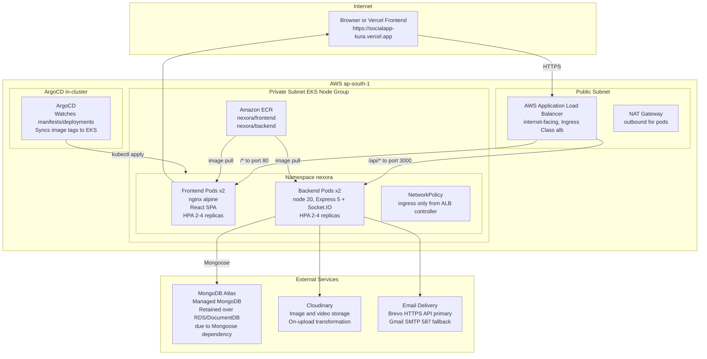
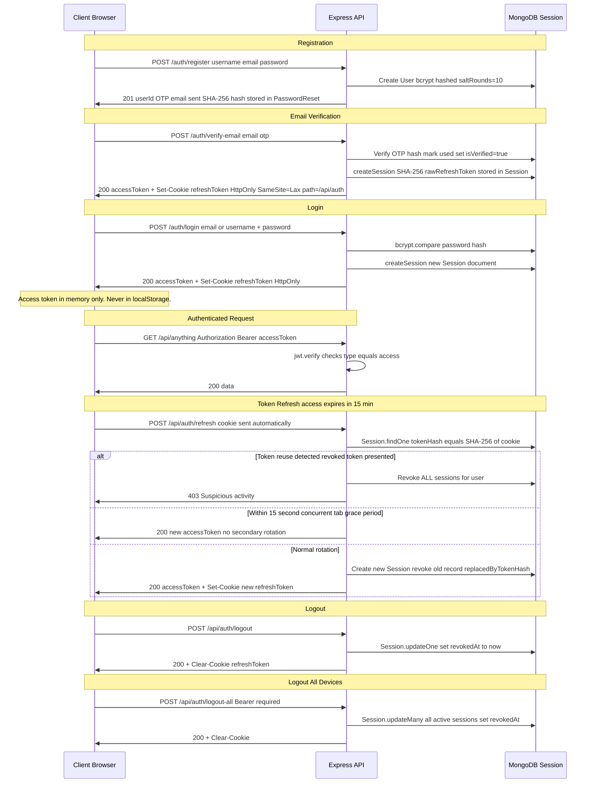

# Nexora

> An Instagram-style MERN social media platform with a full GitOps CI/CD pipeline running on AWS EKS.

Nexora is a full-stack social application built with React 19, Express 5, and MongoDB Atlas. It ships real-time chat over Socket.IO, a follow/private-account graph, scheduled posting with a server-side cron, saved-post collections, in-app notifications, per-post analytics, and a multi-device session model backed by server-stored, SHA-256-hashed, rotating refresh tokens. The backend runs on a self-managed EKS cluster (provisioned with Terraform) with images built by Jenkins and deployed via ArgoCD in a pure GitOps flow.

**Live frontend:** [https://socialapp-kura.vercel.app/](https://socialapp-kura.vercel.app/)  
**Backend:** AWS EKS (ap-south-1) — exposed via ALB Ingress (previously Render)

---

## Table of Contents

1. [Project Overview](#1-project-overview)
2. [Tech Stack](#2-tech-stack)
3. [Features](#3-features)
4. [System Architecture](#4-system-architecture)
5. [CI/CD Pipeline](#5-cicd-pipeline)
6. [Authentication and Security Architecture](#6-authentication-and-security-architecture)
7. [Data Models](#7-data-models)
8. [API Reference](#8-api-reference)
9. [Deployment and Infrastructure](#9-deployment-and-infrastructure)
10. [Local Development Setup](#10-local-development-setup)
11. [Project Structure](#11-project-structure)
12. [Tradeoffs and Future Work](#12-tradeoffs-and-future-work)

---

## 1. Project Overview

Nexora is an Instagram-style MERN social media application. Users can post text, images, and videos; follow each other; send direct messages in real time; bookmark content into named collections; schedule posts for future publication; and receive granular in-app notifications.

The backend has migrated from Render (free tier) to a self-managed AWS EKS cluster, giving the project production-grade infrastructure: Horizontal Pod Autoscaling, Kubernetes NetworkPolicies, ALB Ingress with path-based routing, OIDC/IRSA for the AWS Load Balancer Controller, and a Jenkins to ArgoCD GitOps pipeline. MongoDB Atlas is retained as the managed database rather than migrating to RDS/DocumentDB, because the application is built on Mongoose and Atlas provides the same cloud-managed convenience without a schema migration.

---

## 2. Tech Stack

### Backend

| Package | Version | Purpose |
|---|---|---|
| `node` (base image) | 20 | Runtime |
| `express` | ^5.2.1 | HTTP framework |
| `mongoose` | ^9.3.2 | ODM / MongoDB driver |
| `socket.io` | ^4.8.3 | WebSocket server (real-time chat) |
| `jsonwebtoken` | ^9.0.3 | Access token signing/verification |
| `bcrypt` | ^6.0.0 | Password hashing (salt rounds: 10) |
| `cloudinary` | ^1.41.3 | Image/video storage and transformation |
| `multer` | ^2.1.1 | Multipart form-data parsing |
| `multer-storage-cloudinary` | ^4.0.0 | Cloudinary multer storage adapter |
| `express-rate-limit` | ^8.7.0 | In-memory rate limiting |
| `express-validator` | ^7.3.2 | Input validation and sanitisation |
| `helmet` | ^8.3.0 | HTTP security headers |
| `cors` | ^2.8.6 | CORS middleware |
| `cookie-parser` | ^1.4.7 | HttpOnly cookie parsing |
| `node-cron` | ^4.6.0 | Scheduled post cron runner |
| `nodemailer` | ^6.10.1 | SMTP email transport (dev/fallback) |
| `dotenv` | ^17.3.1 | Environment variable loading |
| `nodemon` | ^3.1.14 | Dev auto-restart |

### Frontend

| Package | Version | Purpose |
|---|---|---|
| `react` | ^19.2.4 | UI framework |
| `react-dom` | ^19.2.4 | React DOM renderer |
| `react-router-dom` | ^7.13.2 | Client-side routing |
| `axios` | ^1.13.6 | HTTP client |
| `socket.io-client` | ^4.8.3 | WebSocket client (real-time chat) |
| `vite` | ^8.0.1 | Build tool and dev server |
| `tailwindcss` | ^3.4.19 | Utility-first CSS |
| `@vitejs/plugin-react` | ^6.0.1 | React fast-refresh plugin |
| `eslint` | ^9.39.4 | Linter |

**Served by:** Nginx (Alpine) in the production container, with a custom `nginx.conf` that adds security headers and falls back all routes to `index.html` for SPA navigation.

---

## 3. Features

### Authentication and Account Management
- Register with username + email + password; OTP email verification required before login
- Login by email **or** username (case-insensitive)
- Multi-device session management — separate server-stored session per login; `POST /auth/logout-all` revokes all sessions at once
- Password reset: request OTP → verify OTP → receive short-lived JWT reset token → set new password (invalidates all sessions)
- Resend verification email
- Dark/light theme toggle (persisted to `localStorage` via `ThemeContext`)

### Social Graph
- Follow / unfollow any public account
- **Private accounts**: follow requests must be approved by the account owner before the follower sees their posts
- Accept or reject incoming follow requests
- View follower and following lists per profile

### Content
- Create posts with optional image, optional video, and/or text (up to 5,000 characters)
- `@mention` parsing — mentioned users receive in-app notifications at publish time (deferred to publish time for scheduled posts)
- `allowDownload` flag per post
- Edit and delete own posts (Cloudinary asset cleanup on delete)
- Post view tracking (`views` count + `viewedBy` deduplication)
- Like / unlike posts (toggle)
- Comment on posts (up to 1,000 characters); delete own comments
- **Scheduled posting**: set a future `scheduledAt` timestamp; server-side cron (`node-cron`, runs every 60 seconds) atomically claims due posts via `findOneAndUpdate` (`scheduled` → `publishing` → `published`), guaranteeing single-execution safety across multi-pod deployments; catch-up routine runs on server boot for missed posts
- **Draft saving**: persist incomplete posts as drafts (text + image + video); resume later

### Bookmarks and Collections
- Save / unsave any post
- Organise saved posts into named collections (create, rename, delete)
- Add/remove posts from any collection
- View all posts in a specific collection

### Messaging
- Start a conversation with any user; conversations are automatically created on first message
- Real-time message delivery via Socket.IO (HTTP REST persists the message first, then the server emits the event)
- Read receipts: messages marked as `read` with a `readAt` timestamp when the recipient opens the conversation
- Unread message count badge in navigation
- Emoji picker in chat input

### Notifications
- In-app notifications for: `like`, `comment`, `follow`, `follow_request`, `follow_accept`, `mention`, `welcome`
- Mark all as read / mark single as read / delete a notification
- Notification dropdown in the navbar with unread badge

### Media
- Image uploads: JPEG, PNG, WebP, GIF — resized to max 1200px wide via Cloudinary transformation
- Video uploads: MP4, WebM, QuickTime — up to 50 MB per file
- Files streamed directly to Cloudinary via `multer-storage-cloudinary` (never stored on disk)

### Analytics
- Per-post analytics: views, likes, comments count
- Per-user aggregate analytics: total posts, total likes, total comments, total views
- `EngagementGraph` component renders engagement over time

---

## 4. System Architecture



**VPC layout** (Terraform-provisioned): one public subnet hosts the ALB and NAT Gateway; EKS worker nodes live in private subnets and reach the internet only through the NAT. Pod-to-pod traffic is further restricted by `NetworkPolicy` resources that allow ingress only from the ingress-nginx controller pods.

**Note on OIDC/IRSA:** The AWS Load Balancer Controller uses IRSA (IAM Roles for Service Accounts) rather than static credentials. Every time the cluster is rebuilt, the OIDC provider must be re-associated and the IAM service account re-created (see `handbook.md` and section 9 below).

---

## 5. CI/CD Pipeline

```mermaid
flowchart LR
    Dev["Developer\ngit push to main"]

    subgraph Jenkins["Jenkins EC2 outside EKS"]
        S1["Stage 1 Prevent CI Loop\nSkips build if commit starts\nwith ci: update image tags"]
        S2["Stage 2 Basic Tests\nAsserts dirs Dockerfiles\nand manifest ECR references"]
        S3["Stage 3 Login to ECR\naws ecr get-login-password\npipe to docker login"]
        S4["Stage 4 Build and Push Backend\ndocker build ./backend\npush ECR nexora/backend:N"]
        S5["Stage 5 Build and Push Frontend\ndocker build VITE_API_URL=/api\npush ECR nexora/frontend:N"]
        S6["Stage 6 Update Manifests\nsed replaces image tag in\nboth deployment yamls"]
        S7["Stage 7 Commit and Push Manifests\ngit commit ci: update image tags to build N\ngit push to main"]
    end

    subgraph ArgoCDPipeline["ArgoCD in-cluster"]
        Watch["Watches manifests/deployments on GitHub"]
        Sync["Detects image tag diff\nkubectl apply rolling update"]
    end

    EKS["EKS Pods\nRunning new image"]

    Dev --> S1 --> S2 --> S3 --> S4 --> S5 --> S6 --> S7
    S7 -->|git push| Watch
    Watch --> Sync --> EKS
```



### Stage details

| Stage | What it does |
|---|---|
| **Prevent CI Loop** | Reads the last commit message with `git log -1 --pretty=%B`. If it starts with `"ci: update image tags"`, the build is aborted with `NOT_BUILT` to prevent the manifest push from re-triggering Jenkins infinitely. |
| **Basic Tests** | Shell assertions: verifies that `backend/`, `frontend/social-frontend/`, both Dockerfiles, and both Kubernetes deployment manifests exist on disk. Also `grep`s that the manifests reference `nexora/backend` and `nexora/frontend`. |
| **Login to ECR** | Uses the Jenkins EC2 instance profile to obtain an ECR password and authenticates Docker. |
| **Build and Push Backend** | Builds `./backend` using `node:20` base. Tags with `$BUILD_NUMBER`. Pushes to `276096488420.dkr.ecr.ap-south-1.amazonaws.com/nexora/backend`. |
| **Build and Push Frontend** | Multi-stage build: Node 20 build stage (Vite) with `--build-arg VITE_API_URL=/api` baked in, then copied into `nginx:alpine`. Tags and pushes to ECR. |
| **Update Manifests** | `sed -i` replaces the `image:` line in both deployment YAMLs with the new ECR tag in-place on the Jenkins workspace. |
| **Commit and Push Manifests** | Configures git identity (`jenkins@ci.com`), stages both manifest files, commits with `"ci: update image tags to build N [skip ci]"` and pushes to `main`. If no manifest changed, the commit is skipped. |

**ArgoCD** watches the `manifests/deployments/` path of the same repository. On detecting a change in either deployment YAML, it performs a `kubectl apply`, triggering a rolling update in the `nexora` namespace.

---

## 6. Authentication and Security Architecture

### Token Flow



### Token Specifics

| Property | Value | Source |
|---|---|---|
| Access token lifetime | `15m` (default; overridable via `ACCESS_TOKEN_EXPIRES_IN`) | `tokenService.js` |
| Refresh token lifetime | 7 days | `tokenService.js` `DEFAULT_REFRESH_LIFETIME_MS` |
| Refresh token storage (server) | SHA-256 hash in `Session.tokenHash` | `Session` model, MongoDB TTL index |
| Refresh token storage (client) | HttpOnly cookie, `SameSite=Lax`, `path=/api/auth`, `secure` auto-detected via `x-forwarded-proto` | `tokenService.js` `getCookieOptions` |
| Access token storage (client) | In-memory only — React state (`AuthContext`) + module-level variable in `api.js`. Explicitly **never** written to `localStorage`. | `AuthContext.jsx` |
| Token reuse detection | If a revoked token is presented, all sessions for that user are immediately revoked. | `auth.js` `refreshToken` |
| Concurrent-tab grace period | 15 seconds — a revoked token within this window issues a fresh access token without a second rotation. | `auth.js` `refreshToken` |
| Session TTL cleanup | MongoDB TTL index on `Session.expiresAt` auto-deletes expired documents. | `Session.js` |

### Security Measures

| Measure | Implementation detail |
|---|---|
| **Password hashing** | `bcrypt` with `saltRounds = 10`, via `userSchema.pre("save")` hook — runs only when `password` is modified. |
| **Rate limiting login** | `authLimiter`: 5 requests / 15 min window on `/api/auth/login` |
| **Rate limiting register** | `registerLimiter`: 3 requests / 60 min window on `/api/auth/register` |
| **Rate limiting OTP and password reset** | `otpLimiter`: 10 requests / 15 min window on `/forgot-password`, `/verify-otp`, `/reset-password`, `/verify-email`, `/resend-verification` |
| **Rate limiting token refresh** | `refreshLimiter`: 120 requests / 15 min window on `/api/auth/refresh` |
| **Rate limiting general API** | `generalLimiter`: 1,000 requests / 15 min window applied to all `/api/*` routes |
| **Helmet.js** | Custom CSP: `defaultSrc 'self'`, `scriptSrc 'self'`, `imgSrc` limited to self plus Cloudinary, `frameAncestors 'none'`, `objectSrc 'none'`; `crossOriginResourcePolicy: cross-origin` |
| **CORS** | Explicit allow-list: `https://socialapp-kura.vercel.app`, `http://localhost:5173`, `http://localhost:5174`, plus any comma-separated values in `CLIENT_URL`. `credentials: true` for cookie transport. |
| **Input validation** | `express-validator` across all mutation routes: username format (alphanumeric + `_`, 3-30 chars), email format, password min 8 chars, post text max 5,000 chars, comment max 1,000 chars, search query max 100 chars plus `.escape()`. |
| **OTP hashing** | Both password-reset and email-verification OTPs stored as `crypto.createHash("sha256")` digests — raw OTP never persisted. OTPs expire in 10 minutes via `PasswordReset.expiresAt` TTL index. |
| **CSRF** | `SameSite=Lax` on the refresh cookie and explicit CORS origin allow-list together prevent cross-site request forging of the cookie-based refresh route. |
| **XSS** | Access token never written to `localStorage` or any DOM-accessible storage. Nginx CSP headers mirror the Helmet config, providing a second enforcement layer. |
| **Secrets management** | All runtime secrets injected into pods via Kubernetes `Secret` (`nexora-backend-secrets`) referenced in the deployment via `envFrom.secretRef`. |
| **Socket.IO auth** | WebSocket connections authenticated at handshake time: client sends in-memory access token in `socket.handshake.auth.token`; server verifies with `jwt.verify` and checks `type === "access"` before allowing connection. |
| **Nginx security headers** | Frontend container adds `X-Content-Type-Options: nosniff`, `X-Frame-Options: DENY`, `Referrer-Policy: strict-origin-when-cross-origin`, `Permissions-Policy: camera=(), microphone=(), geolocation=()`. |
| **trust proxy** | `app.set("trust proxy", 1)` so `req.ip` and the `secure` cookie flag behave correctly behind the ALB. |

---

## 7. Data Models

| Model | Key fields | Relationships |
|---|---|---|
| **User** | `username` (unique, lowercase), `email` (unique, lowercase), `password` (bcrypt), `profilePicture`, `coverImage`, `bio`, `isPrivate`, `isVerified`, `savedPosts[]`, `followers[]`, `following[]` | `savedPosts -> Post`, `followers/following -> User` |
| **Post** | `userId`, `text` (max 5000), `image`, `video`, `allowDownload`, `mentions[]`, `views`, `viewedBy[]`, `likes[]`, `comments[]` (embedded), `status` (draft/scheduled/publishing/published), `scheduledAt`, `claimedAt` | `userId -> User`, `mentions/likes/viewedBy -> User` |
| **Session** | `userId`, `tokenHash` (SHA-256 of raw refresh token, unique), `expiresAt` (TTL), `revokedAt`, `replacedByTokenHash`, `userAgent`, `ip` | `userId -> User`; TTL index on `expiresAt` |
| **PasswordReset** | `userId`, `otp` (SHA-256 hash), `expiresAt` (TTL), `used`, `purpose` (password-reset or email-verification) | `userId -> User`; TTL index on `expiresAt` |
| **Notification** | `recipient`, `sender`, `type` (like/comment/welcome/follow/follow_request/follow_accept/mention), `post`, `followRequest`, `message`, `read` | `recipient/sender -> User`, `post -> Post`, `followRequest -> FollowRequest` |
| **FollowRequest** | `requester`, `recipient`, `status` (pending/accepted/rejected) | `requester/recipient -> User`; compound unique index (requester, recipient) |
| **Conversation** | `participants[]` (2 or more), `lastMessage` {text, sender, createdAt, read}, `updatedAt` | `participants -> User` |
| **Message** | `conversationId`, `sender`, `text`, `read`, `readAt` | `conversationId -> Conversation`, `sender -> User` |
| **Collection** | `userId`, `name`, `posts[]` | `userId -> User`, `posts -> Post`; compound unique index (userId, name) |
| **Draft** | `userId`, `text`, `image`, `video` | `userId -> User` |

---

## 8. API Reference

All routes are prefixed with `/api`. **Required** = `Authorization: Bearer <accessToken>` header needed. **Public** = no token required. **Optional** = proceeds with or without a valid token.

### Auth `/api/auth`

| Method | Path | Auth | Purpose |
|---|---|---|---|
| POST | `/register` | Public | Register new user; sends OTP verification email |
| POST | `/login` | Public | Login (email or username); returns access token + sets refresh cookie |
| POST | `/refresh` | Public | Rotate refresh token; returns new access token |
| POST | `/logout` | Public | Revoke current session; clears cookie |
| POST | `/logout-all` | Required | Revoke all sessions for the authenticated user |
| GET | `/me` | Required | Return current user object |
| POST | `/verify-email` | Public | Verify email OTP; logs user in on success |
| POST | `/resend-verification` | Public | Re-send email verification OTP |
| POST | `/forgot-password` | Public | Send password-reset OTP email |
| POST | `/verify-otp` | Public | Verify reset OTP; returns short-lived reset JWT |
| POST | `/reset-password` | Public | Set new password using reset JWT; revokes all sessions |

### Posts `/api/posts`

| Method | Path | Auth | Purpose |
|---|---|---|---|
| POST | `/` | Required | Create post (image/video multipart or text; optional `scheduledAt`) |
| GET | `/` | Optional | Get feed posts |
| GET | `/search` | Required | Full-text search posts by `?q=` |
| GET | `/saved` | Required | Get authenticated user's saved posts |
| GET | `/scheduled` | Required | Get authenticated user's scheduled posts |
| GET | `/analytics/user` | Required | Aggregate analytics for authenticated user |
| GET | `/analytics/user/:userId` | Required | Aggregate analytics for a specific user |
| GET | `/:id/analytics` | Required | Per-post analytics |
| GET | `/:id` | Required | Get single post by ID |
| POST | `/:id/like` | Required | Toggle like on a post |
| POST | `/:id/save` | Required | Toggle save on a post |
| POST | `/:id/comment` | Required | Add comment |
| POST | `/:id/cancel-schedule` | Required | Cancel a scheduled post |
| DELETE | `/:postId/comments/:commentId` | Required | Delete a comment |
| PUT | `/:id` | Required | Update post |
| DELETE | `/:id` | Required | Delete post (removes Cloudinary assets) |

### Users `/api/users`

| Method | Path | Auth | Purpose |
|---|---|---|---|
| GET | `/search` | Required | Search users by username |
| GET | `/:userId` | Required | Get user profile |
| GET | `/:userId/posts` | Required | Get posts by a specific user |
| PUT | `/profile` | Required | Update profile (username, bio, profilePicture, coverImage) |
| POST | `/:userId/follow` | Required | Follow or unfollow; sends follow request for private accounts |
| GET | `/:userId/followers` | Required | List followers |
| GET | `/:userId/following` | Required | List following |
| GET | `/follow-requests` | Required | List pending follow requests for authenticated user |
| PUT | `/follow-requests/:requestId` | Required | Accept or reject a follow request |

### Notifications `/api/notifications`

| Method | Path | Auth | Purpose |
|---|---|---|---|
| GET | `/` | Required | Get all notifications |
| PUT | `/read` | Required | Mark all notifications as read |
| PUT | `/:id/read` | Required | Mark single notification as read |
| DELETE | `/:id` | Required | Delete a notification |

### Chats `/api/chats`

| Method | Path | Auth | Purpose |
|---|---|---|---|
| GET | `/unread-count` | Required | Total unread message count |
| GET | `/conversations` | Required | List all conversations |
| PUT | `/conversations/:conversationId/read` | Required | Mark conversation messages as read |
| GET | `/messages/:conversationId` | Required | Get messages for a conversation |
| POST | `/messages` | Required | Send message; creates conversation if needed; emits Socket.IO event |

### Collections `/api/collections`

| Method | Path | Auth | Purpose |
|---|---|---|---|
| GET | `/` | Required | List user's collections |
| POST | `/` | Required | Create collection |
| PUT | `/:id` | Required | Rename collection |
| DELETE | `/:id` | Required | Delete collection |
| POST | `/:id/posts` | Required | Add post to collection |
| DELETE | `/:id/posts/:postId` | Required | Remove post from collection |
| GET | `/:id/posts` | Required | List posts in a collection |

### Drafts `/api/drafts`

| Method | Path | Auth | Purpose |
|---|---|---|---|
| GET | `/` | Required | List user's drafts |
| POST | `/` | Required | Save new draft |
| PUT | `/:id` | Required | Update draft |
| DELETE | `/:id` | Required | Delete draft |

---

## 9. Deployment and Infrastructure

### Infrastructure provisioning (Terraform)

The VPC and EKS cluster are provisioned using the Terraform configuration in `AWS-TF/`. The Terraform state backend is S3 (`backend.tf`). Modules cover VPC (public + private subnets, NAT Gateway, Internet Gateway) and EKS (managed node group in private subnets).

```bash
cd AWS-TF
terraform init
terraform plan
terraform apply   # approximately 15-20 minutes
aws eks update-kubeconfig --region ap-south-1 --name <cluster-name>
kubectl get nodes
```

### OIDC and IRSA for ALB Controller

The ALB Controller uses IRSA — **not** static credentials. After every `terraform apply` (the OIDC issuer URL is cluster-unique):

```bash
# Associate OIDC provider
eksctl utils associate-iam-oidc-provider --cluster <cluster-name> --approve

# Create IAM policy (skip if already exists from a prior run)
aws iam create-policy \
  --policy-name AWSLoadBalancerControllerIAMPolicy \
  --policy-document file://AWS-TF/iam_policy.json

# Create IRSA service account
eksctl create iamserviceaccount \
  --cluster <cluster-name> \
  --namespace kube-system \
  --name aws-load-balancer-controller \
  --attach-policy-arn arn:aws:iam::<account-id>:policy/AWSLoadBalancerControllerIAMPolicy \
  --approve

# Install controller via Helm
helm repo add eks https://aws.github.io/eks-charts && helm repo update
helm install aws-load-balancer-controller eks/aws-load-balancer-controller \
  -n kube-system \
  --set clusterName=<cluster-name> \
  --set serviceAccount.create=false \
  --set serviceAccount.name=aws-load-balancer-controller
```

### Apply application manifests

```bash
kubectl create namespace nexora

# Create the secret manually — fill in base64-encoded values from backend/.env.example
kubectl apply -f manifests/deployments/secrets.yaml

kubectl apply -f manifests/deployments/backend-deploy.yaml
kubectl apply -f manifests/deployments/frontend-deploy.yaml
kubectl apply -f manifests/svcs/backend-svc.yaml
kubectl apply -f manifests/svcs/frontend-svc.yaml
kubectl apply -f manifests/hpa/hpa-backend.yaml
kubectl apply -f manifests/hpa/hpa-frontend.yaml
kubectl apply -f manifests/netpol/netpol.yaml
kubectl apply -f manifests/ingress/ingress.yaml   # triggers ALB provisioning

kubectl get ingress -n nexora   # wait for ADDRESS field
```

### Environment variables (names only — never commit real values)

**Backend** (all injected via `nexora-backend-secrets` Kubernetes Secret; see `backend/.env.example`):

| Variable | Purpose |
|---|---|
| `PORT` | Express listen port (default `3000`) |
| `DATABASE` | MongoDB Atlas connection string |
| `CLIENT_URL` | Comma-separated allowed CORS origins |
| `JWT_ACCESS_SECRET` | HMAC secret for access tokens |
| `JWT_REFRESH_SECRET` | Reserved; refresh tokens are opaque random bytes, not JWTs |
| `ACCESS_TOKEN_EXPIRES_IN` | Access token TTL (default `15m`) |
| `COOKIE_SECURE` | Set `"true"` in production to enforce Secure cookie flag |
| `CLOUD_NAME` | Cloudinary cloud name |
| `API_KEY` | Cloudinary API key |
| `API_SECRET` | Cloudinary API secret |
| `EMAIL_USER` | SMTP sender or Brevo sender address |
| `EMAIL_PASS` | Gmail app password (SMTP fallback) |
| `BREVO_API_KEY` | Brevo HTTPS API key (preferred over SMTP on cloud hosts) |
| `NODE_ENV` | `production` or `development` |

**Frontend** (baked in at build time via Vite; see `frontend/social-frontend/.env.example`):

| Variable | Purpose |
|---|---|
| `VITE_API_URL` | Backend API base URL (set to `/api` in production Docker build) |

---

## 10. Local Development Setup

### Prerequisites
- Node.js 20+
- MongoDB (local) or a MongoDB Atlas free cluster
- Cloudinary account (free tier is sufficient)
- Gmail account with App Passwords enabled, or a Brevo free-tier account

### Backend

```bash
git clone https://github.com/Narendra-619/Nexora.git
cd Nexora/backend

cp .env.example .env
# Edit .env: fill in DATABASE, JWT_ACCESS_SECRET, CLOUD_NAME, API_KEY,
# API_SECRET, EMAIL_USER, EMAIL_PASS (or BREVO_API_KEY)

npm install
npm run dev   # nodemon; listens on PORT (default 3000)
```

### Frontend

```bash
cd ../frontend/social-frontend

cp .env.example .env
# Set VITE_API_URL=http://localhost:3000

npm install
npm run dev   # Vite; listens on http://localhost:5173
```

The frontend proxies all API calls through Axios using `VITE_API_URL` as the base. The backend CORS policy already includes `http://localhost:5173`.

For Socket.IO in local dev, the frontend connects to the same `VITE_API_URL` origin — no separate WebSocket URL is needed.

---

## 11. Project Structure

```
Nexora/
├── Jenkinsfile                  # 7-stage Jenkins pipeline
├── handbook.md                  # EKS rebuild runbook step-by-step
├── .gitignore
│
├── AWS-TF/                      # Terraform VPC + EKS
│   ├── main.tf                  # Module wiring: vpc + eks
│   ├── variables.tf
│   ├── outputs.tf
│   ├── providers.tf
│   ├── backend.tf               # S3 remote state
│   ├── s3.tf
│   ├── iam_policy.json          # ALB Controller IAM policy
│   └── modules/
│       ├── vpc/                 # VPC, subnets, NAT, IGW
│       └── eks/                 # EKS control plane + managed node group
│
├── manifests/                   # Kubernetes manifests (ArgoCD watches this)
│   ├── deployments/
│   │   ├── backend-deploy.yaml  # 2 replicas, resource limits, envFrom secret
│   │   ├── frontend-deploy.yaml # 2 replicas, resource limits
│   │   └── secrets.yaml         # Secret template (reference only)
│   ├── svcs/
│   │   ├── backend-svc.yaml     # ClusterIP, port 80 to targetPort 3000
│   │   └── frontend-svc.yaml    # ClusterIP, port 80 to targetPort 80
│   ├── hpa/
│   │   ├── hpa-backend.yaml     # minReplicas 2, maxReplicas 4, cpu 50%
│   │   └── hpa-frontend.yaml
│   ├── netpol/
│   │   └── netpol.yaml          # Restrict ingress to ingress-nginx controller
│   └── ingress/
│       └── ingress.yaml         # ALB internet-facing, /api to backend, / to frontend
│
├── backend/                     # Express 5 API
│   ├── index.js                 # App bootstrap, CORS, Helmet, Socket.IO, DB connect
│   ├── Dockerfile               # node:20, EXPOSE 5000 (app listens on PORT 3000)
│   ├── .env.example
│   ├── controllers/
│   │   ├── auth.js              # register, login, refresh, logout, logoutAll, getMe
│   │   ├── passwordResetController.js
│   │   ├── postController.js    # CRUD, likes, comments, search, analytics, scheduling
│   │   ├── userController.js    # profile, search, user posts
│   │   ├── followController.js  # follow/unfollow, requests, followers/following
│   │   ├── notificationController.js
│   │   ├── chatController.js    # conversations, messages, Socket.IO injection
│   │   ├── collectionController.js
│   │   └── draftController.js
│   ├── routes/                  # Express routers, one per resource
│   ├── models/
│   │   ├── User.js  Post.js  Session.js  PasswordReset.js
│   │   ├── Notification.js  FollowRequest.js
│   │   ├── Conversation.js  Message.js
│   │   └── Collection.js  Draft.js
│   ├── middleware/
│   │   ├── authMiddleware.js    # protect() — Bearer token verification
│   │   ├── optionalAuth.js      # Soft auth, continues without token
│   │   ├── rateLimiter.js       # authLimiter, registerLimiter, otpLimiter, etc.
│   │   ├── validate.js          # express-validator rule sets
│   │   ├── upload.js            # Cloudinary + multer config, 50 MB limit
│   │   └── errorHandler.js      # Global error handler
│   └── services/
│       ├── tokenService.js      # generateAccessToken, createSession, cookie helpers
│       ├── emailService.js      # Brevo HTTPS API + Nodemailer SMTP fallback
│       └── scheduler.js         # node-cron: atomic claiming & publishing of scheduled posts
│
└── frontend/
    └── social-frontend/         # React 19 + Vite + Tailwind CSS
        ├── Dockerfile           # Multi-stage: node:20 build to nginx:alpine serve
        ├── nginx.conf           # SPA fallback + security headers
        ├── vite.config.js
        ├── .env.example
        └── src/
            ├── App.jsx          # Router, context providers, protected routes
            ├── context/
            │   ├── AuthContext.jsx   # Token memory store, refresh bootstrap, logout
            │   ├── ChatContext.jsx   # Socket.IO connection, online presence
            │   ├── ThemeContext.jsx  # Dark/light toggle
            │   └── ToastContext.jsx  # Global toast notifications
            ├── pages/
            │   ├── Feed.jsx  Profile.jsx  Messenger.jsx  Analytics.jsx
            │   ├── SavedPosts.jsx  ScheduledPosts.jsx  DraftsPage.jsx
            │   ├── Login.jsx  Register.jsx  VerifyOTP.jsx
            │   ├── ForgotPassword.jsx  ResetPassword.jsx
            │   ├── FollowersList.jsx  FollowingList.jsx  PostPage.jsx
            │   └── NotFound.jsx
            ├── components/
            │   ├── PostCard.jsx           # Full post UI: like, comment, save
            │   ├── CreatePost.jsx         # Post composer with scheduling, drafts, emoji
            │   ├── Navbar.jsx             # Top nav with notification dropdown
            │   ├── NotificationDropdown.jsx
            │   ├── CommentSection.jsx
            │   ├── CollectionPickerModal.jsx
            │   ├── FollowRequestsPanel.jsx
            │   ├── ProtectedRoute.jsx     # Redirects unauthenticated users
            │   └── ...
            └── utils/
                └── api.js               # Axios instance, Bearer injection, auth-failure hook
```

---

## 12. Tradeoffs and Future Work

### Intentional Architecture Tradeoffs

**Stateless access tokens without per-request database validation.**  
Access tokens are short-lived (15 minutes) and completely stateless, eliminating per-request database or cache lookups. Refresh tokens are revocable on demand via the server-stored `Session` model (`revokedAt` field). The short access-token lifetime is an intentional engineering tradeoff for optimal API latency and simplicity.

**Per-pod in-memory rate limiting.**  
Rate limiting uses `express-rate-limit` with an in-memory counter per pod. In a multi-replica Kubernetes deployment, limits are enforced per backend instance rather than globally. This avoids introducing an external Redis cluster dependency, keeping operational overhead and costs minimal.

**Best-effort email delivery.**  
Email dispatch prioritizes Brevo's HTTPS REST API with a Gmail SMTP fallback. For development and testing environments without active third-party credentials, OTPs log to the server console rather than failing request execution.

**Managed Atlas database over in-VPC DocumentDB/RDS.**  
MongoDB Atlas was retained rather than migrating to RDS or AWS DocumentDB to preserve native Mongoose ODM capabilities, complex aggregation pipelines, and rapid operational setup without requiring a schema migration.

### Future Improvements

* **Distributed Caching & Global Rate Limiting:** Introduce a Redis cluster (`rate-limit-redis`) to enforce global cluster-wide rate limits and enable multi-node Socket.IO scaling via a Redis adapter.
* **External Secrets Management:** Transition Kubernetes Secrets to AWS Secrets Manager paired with External Secrets Operator (ESO) for automated secret rotation and auditing.
* **Additional Product Features:** Instagram-style Stories, an Explore/Discover recommendation feed, post sharing/reposting, polls, and Highlights.
* **Operational Hardening:** Automated database backup schedules, centralized Prometheus/Grafana metrics dashboards, and distributed tracing.
